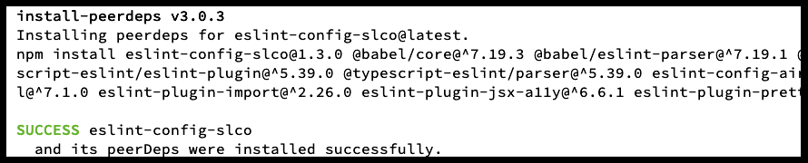
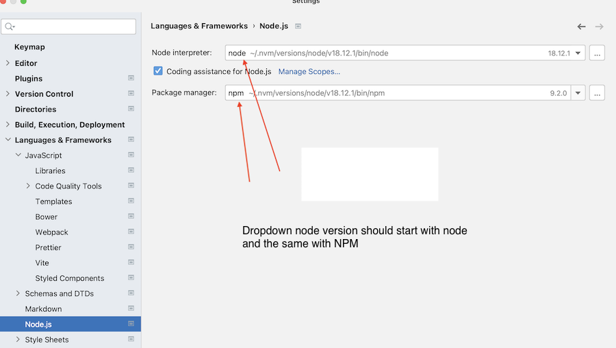
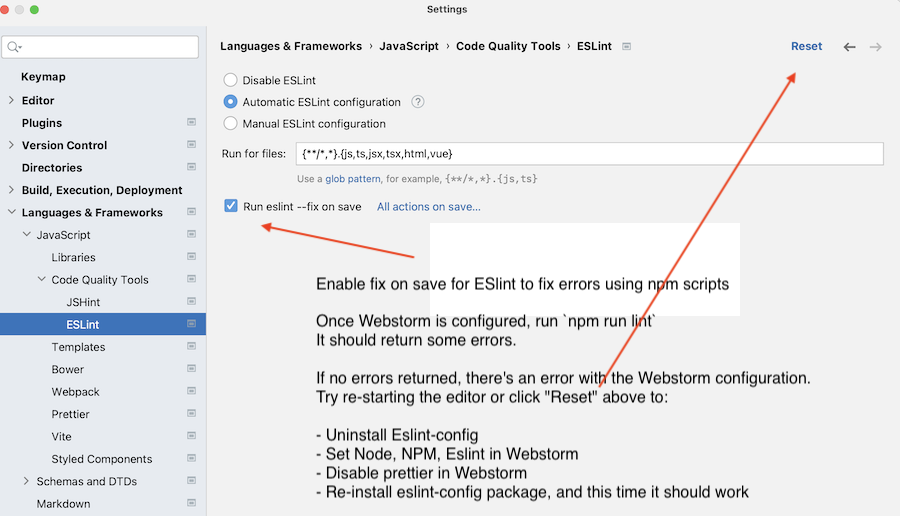
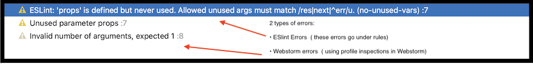
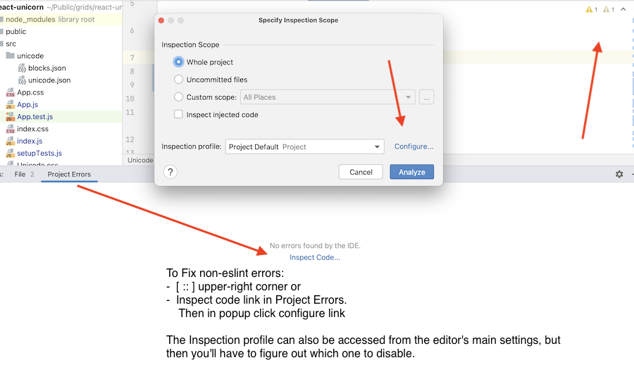
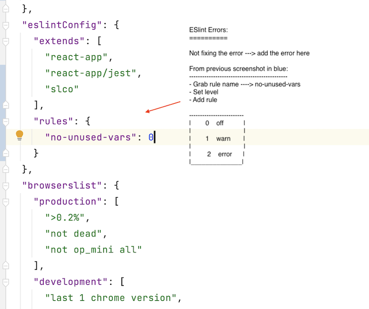

## ESLint-Config-SLCO &nbsp; :page_with_curl:

:coffee: NPMJS <kbd>URL:</kbd>  <a href="https://www.npmjs.
com/package/eslint-config-slco" title="ESLint-config-slco"
target="_blank">ESLint-config-slco</a>

<br />

___Eslint-config-slco___ is an npm package with my eslint enabled and prettier settings.  
Easy to use and easily extended. :beer:

<br />

### I. Install Package

```text
  npm i eslint-config-slco@latest
```

<br />

### II. Extending eslint config in one of two ways:

- creating a new .eslintrc file in root of the project
- creating a new or adding to an exisitng eslintConfig object in package.json

```text
 {
    "extends": ["slco"] // with .eslintrc file
 }

 // or package.json eslintConfig object
 {
  "eslintConfig": {
    "extends": ["eslint-config-slco"] //add last
    }
 }
```

<br />

### III. Add linting & peerdeps scripts

- In package.json file:

```json
 {
  "scripts": {
    "slco": "npx install-peerdeps --dev eslint-config-slco",
    "lint": "eslint .",
    "lint:fix": "eslint . --fix"
  }
}
```

• Before running `slco`, check if the script is available via npm:

```text
 npm run-script  // it shows list of avail scripts. If so type:
 npm run slco
```

&nbsp;..otherwise type:

```text
 npx install-peerdeps --dev eslint-config-slco
```

When correctly installed, it shows a SUCCESS message.



<br />


### IV. To overwrite __eslint__ or __prettier__ settings:

- Do so inside of **rules** for eslint and under **prettier/prettier** for prettier

```text
  // example  
 {
  "extends": [
    "slco" // (last)
  ],
  "rules": { // ESLINT rules
    "no-console": 2, // overwrites eslint 1-warning with 2-error
    
    "prettier/prettier": [ // PRETTIER rules
      "warn",
      {
        "trailingComma": "es5",
        "singleQuote": true,
        "printWidth": 200, // overwrites 70 with 200
      }
    ]
  }
 }
```

<br />

## To have IDE lint files:


### WebStorm :book:

<br />

Enable Node in Webstorm



<br />
<br />
 

Set ESlint




<br /><br />

##### Fixing Errors





<br />
<br />


Non ESlint errors




<br /><br />

Adding ESLint error to Rules in Package.json




<br /><br />


#### Using VSCode :book:

- In VSCode settings or
- Inside a new `.vscode/settings.json` file

```json
 {
    "editor.codeActionsOnSave": {
        "source.fixAll.eslint": true
    }
 }
```

<br />


#### REFERENCE FILES I:

```text
  // REFERENCE PURPOSES I: REACT & JEST

  // package.json
  "dependencies": {
    ...
    react-test-renderer ^18.2.0         
    @testing-library/jest-dom ^5.16.5       
    @testing-library/react ^13.4.0      
    @testing-library/user-event ^13.5.0      
    jest ^29.3.1      
    jest-environment-jsdom ^29.3.1     
  }

  scripts: {
    ...
    "test": "jest --watchAll"
  }

  // babel.config.js
  module.exports
  = {
  presets: [
    '@babel/preset-env',
    [
      '@babel/preset-react',
      {
        runtime: 'automatic'
      }
    ]
  ]
}

// jest.config.js
module.exports = {
  moduleFileExtensions: [
    'js',
    'jsx'
  ],
  modulePathIgnorePatterns: [
    '<rootDir>/node_modules/'
  ],
  moduleNameMapper: {
    '\\.(css|less)$': '<rootDir>/src/app.css',
    // Support import ~
    '^~(.*)': '<rootDir>/node_modules/$1'
  },
  setupFilesAfterEnv: [
    '<rootDir>/src/setupTests.js'
  ],
  testEnvironment: 'jsdom'
}

/*
 * @jest-environment jsdom //  or per file
*/
```

<br />


REFERENCE FILES II


```text
  // REFERENCE PURPOSES II
  // Adding Cypress to above React/Jest config

  // package.json
  "dependencies": {
    ...
    react-test-renderer ^18.2.0         
    @testing-library/jest-dom ^5.16.5      
    @testing-library/react ^13.4.0
    @testing-library/user-event  ^13.5.0
    jest ^29.3.1
    jest-environment-jsdom ^29.3.1,
    ...,
    "@testing-library/jest-dom": "^5.16.5"       
    "@testing-library/react": "^13.4.0"       
    "@testing-library/user-event": "^13.5.0"      
  }

  scripts: {
    ...
    "test": "jest --watchAll",
    "cypress:open": "./node_modules/.bin/cypress open",
    "cypress:run": "./node_modules/.bin/cypress run",
    "cybookshop": "npm run cypress:open --record --spec 'cypress/e2e/bookshop.spec.cy.js",
    "slco": "npx install-peerdeps --dev eslint-config-slco",
    "lint": "eslint .",
    "lint:fix": "eslint . --fix",
    },
    "eslintConfig": {
    "extends": [
      "react-app",
      "react-app/jest",
      "plugin:cypress/recommended",
      "eslint-config-slco"
    ],
    "rules": {
      "jest/valid-expect": 0,
      "react/prop-types": 0,
      "cypress/no-unnecessary-waiting": 0,
      "testing-library/await-async-utils": 0
    }
  },
  
  ...
  ...

// babel.config.js
module.exports= {
    presets: [
        '@babel/preset-env',
    [
        '@babel/preset-react',
    {
        runtime: 'automatic'
    }
    ]
  ]
}

    // cypress.config.js
    const { defineConfig } = require('cypress')
    require('dotenv').config()
    
    module.exports = defineConfig({
      e2e: {
        baseUrl: process.env.REACT_APP_BASE_URL,
        env: {
          development: process.env.REACT_APP_DEV,
          booksApi: process.env.REACT_APP_BASE_API, // ..8080/books
        },
        pageLoadTimeout: process.env.REACT_APP_PAGE_LOAD_TIMEOUT,
        watchForFileChanges: false,
    
        defaultCommandTimeout: 8000,
        fileServerFolder: process.env.REACT_APP_SERVER_FOLDER, // stubServer
        setupNodeEvents(on, config) {
          // node evts
          console.log('\n\n -| config --> ', config, ' ..l__l__\n')
        },
      },
    })


  // jest.config.js
  module.exports = {
     moduleFileExtensions: [
        'js',
        'jsx'
     ],
     modulePathIgnorePatterns: [
        '<rootDir>/node_modules/'
     ],
     moduleNameMapper: {
        '\\.(css|less)$': '<rootDir>/src/app.css',
        // Support import ~
        '^~(.*)': '<rootDir>/node_modules/$1'
     },
     setupFilesAfterEnv: [
        '<rootDir>/src/setupTests.js'
     ],
     testEnvironment: 'jsdom'
  }
    
/*
 * @jest-environment jsdom //  or per file
*/
```
